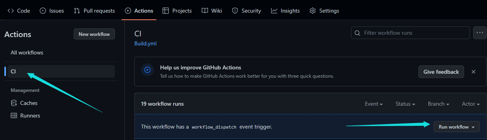

# STM32 系列芯片 microROS 自动化编译库

这个repo可以帮助大家使用`Github Actions`来自动化编译`microROS`库。不再需要在本地搭建`Docker`编译环境！

# 目录结构

```
repo
├── Core
├── Drivers
├── micro_ros_stm32cubemx_utils
└── Middlewares
```

其中，`Core`, `Drivers`, 和 `Middlewares` 都是由 `CubeMX` 自动化生成的。而 `micro_ros_stm32cubemx_utils` 则是microROS的核心库，我们之后编译的静态库就是基于这个的。

# 使用方法

## 0. fork 并 克隆本仓库

但是，克隆下来的仓库是根据我的需求配置的，不符合你的需求，需要按照下面的步骤修改哦~

## 1. 获取 `microROS` 代码

由于 `microROS` 代码是区分 `ROS2` 的版本的，因此需要根据你的需求选择不同的版本。

仓库地址为：https://github.com/micro-ROS/micro_ros_stm32cubemx_utils


注意不要直接克隆，下载压缩包就可以了！

用你下载下来的版本替换本仓库中的 `micro_ros_stm32cubemx_utils` 文件夹。注意要保持文件夹名字相同！

## 2. 修改 `.ioc` 文件并生成代码

这里需要根据你的芯片型号来修改 `.ioc` 文件。在修改和重新生成代码的过程中，需要注意一下几点：

### 1. 使用 `FreeRTOS` 中间件，

`microROS` 需要使用 `FreeRTOS` 作为中间件，因此需要修改 `.ioc` 文件，将 `FreeRTOS` 中间件添加到 项目中。

### 2. 修改 `FreeRTOS` 中的 `Stack Size`

`microROS` 需要大于 `10kb` 的`Stack Size`，因此需要修改 `FreeRTOS` 中的 `Stack Size`。

具体配置选项在 `FreeRTOS` -> `Tasks and Queues` 中，双击 `defaultTask` 进行修改。


### 3. 按需要设置通信协议，比如使用 `USART + DMA`

1. 初始化USART并启用其DMA请求功能。
2. 创建并配置两个DMA通道，一个用于Tx（传输），一个用于Rx（接收）。
3. 对于每个DMA通道，将优先级设置为非常高（DMA_PRIORITY_VERY_HIGH）。
4. 对于Rx通道，将其配置为循环模式（DMA_CIRCULAR）。
5. 开启串口的`UARTx global interrupt`


### 4. 在 `Project Manager` 选项卡中，配置 `Toolchain` 为 `Makefile`


### 5. 生成代码，注意 `.ioc` 的保存位置是否正确。

### 6. 如果第一步复制好的文件夹不见了，请再复制一遍。

## 3. 修改 `microROS` 生成脚本

### 1. 修改 `Makefile`

在 `Makefile` 中找到 `build the application` 部分，在上方插入以下内容：

```makefile
#######################################
# micro-ROS addons
#######################################
LDFLAGS += micro_ros_stm32cubemx_utils/microros_static_library/libmicroros/libmicroros.a
C_INCLUDES += -Imicro_ros_stm32cubemx_utils/microros_static_library/libmicroros/microros_include

# Add micro-ROS utils
C_SOURCES += micro_ros_stm32cubemx_utils/extra_sources/custom_memory_manager.c
C_SOURCES += micro_ros_stm32cubemx_utils/extra_sources/microros_allocators.c
C_SOURCES += micro_ros_stm32cubemx_utils/extra_sources/microros_time.c

# Set here the custom transport implementation
C_SOURCES += micro_ros_stm32cubemx_utils/extra_sources/microros_transports/dma_transport.c

print_cflags:
	@echo $(CFLAGS)
```

注意，`@echo $(CFLAGS)` 前面的是`tab`而不是空格，如果复制下来是空格，请手动修改为`tab`。

### 2. 修改 `library_generation.sh`

默认的编译脚本是需要人机交互的，我们将其去掉以实现自动编译。

打开 `micro_ros_stm32cubemx_utils\microros_static_library\library_generation\library_generation.sh` 文件，按照如下方式修改:

将：
```bash
if [ $RET_CODE = "0" ]; then
    echo "Found CFLAGS:"
    echo "-------------"
    echo $RET_CFLAGS
    echo "-------------"
    read -p "Do you want to continue with them? (y/n)" -n 1 -r
    echo
    if [[ $REPLY =~ ^[Yy]$ ]]
    then
        echo "Continuing..."
    else
        echo "Aborting"
        exit 0;
    fi
else
    echo "Please read README.md to update your Makefile"
    exit 1;
fi
```

修改为：

```bash
if [ $RET_CODE = "0" ]; then
    echo "Found CFLAGS:"
    echo "-------------"
    echo $RET_CFLAGS
    echo "-------------"
    # read -p "Do you want to continue with them? (y/n)" -n 1 -r
    echo
    if [[ $REPLY =~ ^[Yy]$ ]]
    then
        echo "Continuing..."
    else
        echo "Aborting";
        # exit 0;
    fi
else
    echo "Please read README.md to update your Makefile"
    exit 1;
fi
```

修改前后差异如下:


### 3. 将代码推送到 `GitHub`

## 4. 开始编译

前往你的仓库的 `Actions` 页面，点击 左边的 `CI` 按钮，再点击右边的 `Run worlflow` 就可以开始编译了！。



编译完成后的结果，可以在仓库的 `Release` 页面直接下载。


